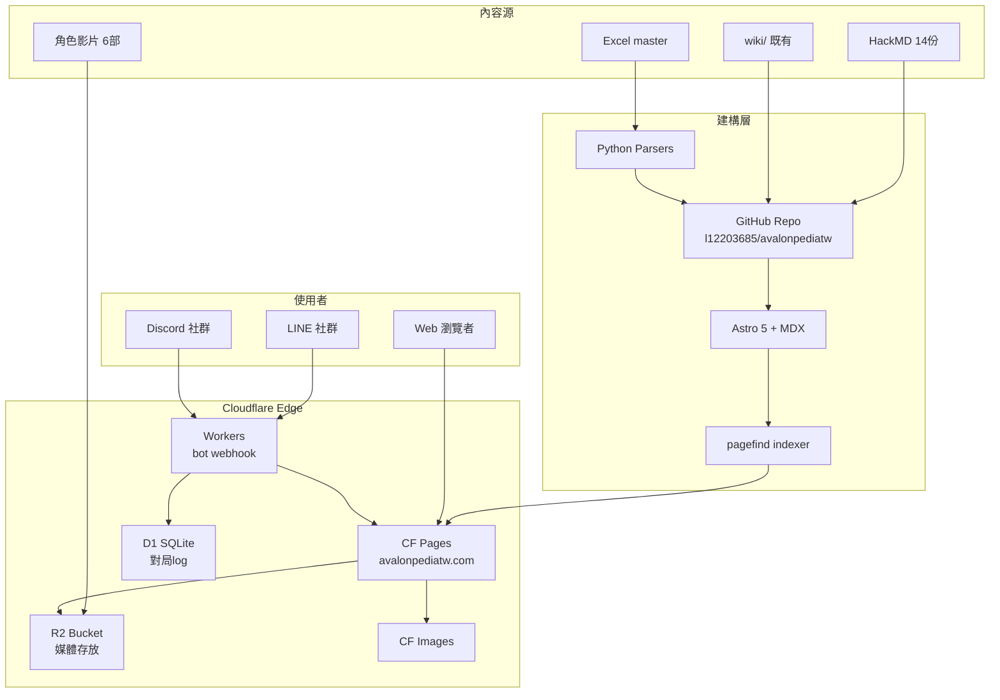
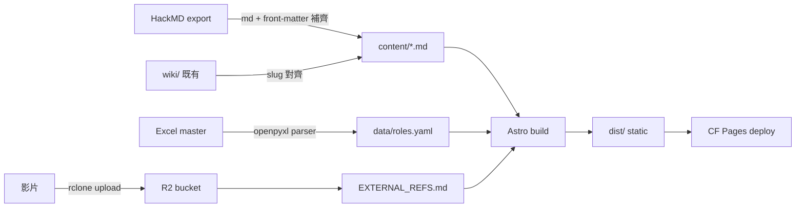
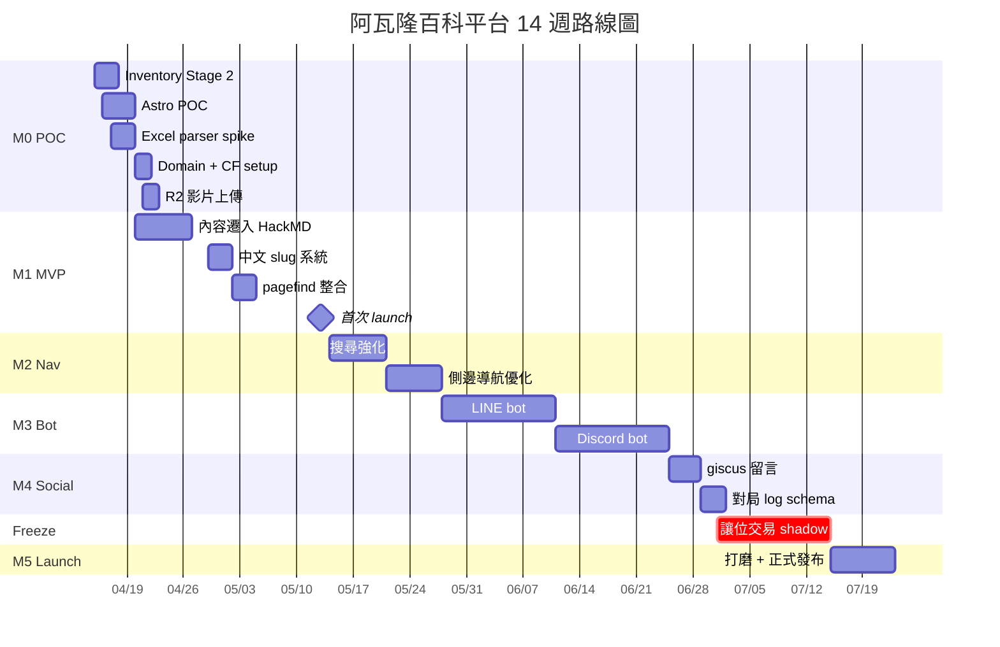

# 阿瓦隆百科平台 — 完整開發規劃 PLAN.md

> 產出時間: 2026-04-14 08:39 +08
> 版本: v1.0
> 時區: Asia/Taipei (+08)
> Repo: `l12203685/avalonpediatw`

---

## 0. Executive Summary

**目標**：打造中文繁體為主的「線上阿瓦隆百科平台」— 整合百科內容、對局統計、社群 bot、線上工具，單一入口 `avalonpediatw.com`。

**MVP 範圍（M1, 2026-05-13 前）**：
- 靜態百科站上線（規則 / 角色 / 策略 / 變體）
- 從 HackMD 14 份 + `wiki/` 既有內容遷入
- 中文 slug + 基礎導航 + 全文搜尋（pagefind）
- 部署於 Cloudflare Pages（$0）

**Non-goals（v1 不做）**：
- 線上即時對局（既有 `packages/` 原型保留但不進 v1，避開 7/7 交易系統衝刺期）
- 使用者帳號系統（用 GitHub OAuth via giscus 代理）
- App / 手機原生
- AI 對戰 / 自動解說

**里程碑**：

| M | 日期 | 交付 |
|---|------|------|
| M0 | 2026-04-15 ~ 04-28 | 內容整併 + 技術棧 POC |
| M1 | 2026-04-29 ~ 05-13 | 內容 MVP 上線 |
| M2 | 2026-05-14 ~ 05-27 | 搜尋 + 導航強化 |
| M3 | 2026-05-28 ~ 06-24 | LINE/Discord bot 整合 |
| M4 | 2026-06-25 ~ 07-01 | 留言/對局 log（giscus） |
| **凍結** | **2026-07-01 ~ 07-14** | 讓位交易 shadow-live（07-07） |
| M5 | 2026-07-15 ~ 07-22 | 打磨 + 正式 launch |

---

## 1. Vision & Scope

### 1.1 願景
成為繁體中文阿瓦隆玩家第一站：新手入門 → 中階策略 → 高階戰術 → 社群互動，皆在同一平台完成。

### 1.2 目標受眾
- **主要**：台灣/港澳阿瓦隆玩家（新手~中階）
- **次要**：桌遊教學者、桌遊店店主、Discord/LINE 社群管理員
- **長期**：繁中桌遊內容創作者（以此平台為知識基底延伸）

### 1.3 核心價值
1. **權威**：內容經校對 + 引用來源（官方規則書 + 社群共識）
2. **即查**：搜尋 < 500ms，手機優先
3. **活**：社群對局 log + 留言持續累積
4. **免費**：MVP 無廣告、無付費牆

### 1.4 成功指標（v1 launch 後 30 天）
- MAU > 500
- 搜尋使用率 > 30%
- Discord bot 加入伺服器數 > 5
- Core Web Vitals 全綠

---

## 2. Content Architecture

### 2.1 分類體系

```
avalonpediatw/
├─ 規則 (rules)
│  ├─ 基礎規則
│  ├─ 遊戲流程
│  └─ 計分與勝負
├─ 角色 (roles)
│  ├─ 正方陣營（梅林、派西維爾、忠臣…）
│  ├─ 反方陣營（莫德雷德、莫甘娜、刺客…）
│  └─ 中立（奧伯倫）
├─ 策略 (strategies)
│  ├─ 身份偽裝
│  ├─ 投票邏輯
│  ├─ 暗示技巧
│  └─ 刺殺判斷
├─ 變體 (variants)
│  ├─ 擴充角色
│  ├─ 自訂規則
│  └─ 競賽規則
└─ 社群 (community)
   ├─ 對局紀錄
   ├─ 玩家訪談
   └─ 賽事報導
```

### 2.2 素材映射

| 來源 | 數量 | 目標分類 | 處理方式 |
|------|------|----------|----------|
| HackMD 筆記 | 14 份 | rules/roles/strategies | Markdown 清洗 + front-matter 補齊 |
| `wiki/` 既有 | ~20 頁 | roles/strategies | 結構對齊 + 中文 slug |
| 角色影片 | 6 部 | roles/*/media | 上傳 R2，頁面嵌入 |
| Excel master | 1 份 | roles（屬性表） | Python parser 轉 JSON/YAML |
| 官方規則書 | PDF | rules | 引用條目 + 外部連結 |

### 2.3 中英策略
- **URL**：繁中 slug（`/角色/梅林`）+ 英文 alias（`/roles/merlin` 302 → 繁中）
- **內文**：繁中為主，專有名詞括號附英文（例：派西維爾 Percival）
- **SEO**：`hreflang=zh-TW` + `<meta name="keywords">` 雙語

---

## 3. Technical Architecture

### 3.1 前端選型

| 候選 | 優點 | 缺點 | 決定 |
|------|------|------|------|
| **Astro 5** | 內容為主、零 JS 預設、MDX 原生、pagefind 一鍵整合 | 互動元件需明確 island | ✅ 採用 |
| Next.js 15 | 生態強 | 對靜態百科太重、hydration 成本高 | ❌ |
| VitePress | Vue 生態 | 客製彈性低 | ❌ |
| Docusaurus | 成熟 | 主題偏 docs 非 wiki | ❌ |

### 3.2 後端
- **MVP**：無（全靜態 + giscus）
- **M3+**：Cloudflare Workers（bot webhook + 對局 log 寫入 D1）
- **避免**：長駐 Node server、自託管 DB

### 3.3 資料層
- **內容**：Markdown/MDX + YAML front-matter in repo（git 即 CMS）
- **結構化**：`data/roles.yaml` / `data/variants.yaml`
- **動態**：Cloudflare D1（SQLite）for M3+ 對局 log

### 3.4 搜尋
- **pagefind**：build time 產 index，client-side 查詢，繁中分詞用 `pagefind.yml` `language: zh-TW`
- **目標**：< 100ms 本地查詢，< 500ms 首次載入 index

### 3.5 媒體
- **Cloudflare R2**：影片 / 大圖（$0 egress to CF Pages）
- **Cloudflare Images**：自動 resize + WebP
- **`content/EXTERNAL_REFS.md`**：R2 bucket 映射表

### 3.6 Bot
- **LINE bot**：LINE Messaging API + CF Workers，斜線命令查角色/規則
- **Discord bot**：discord.py on CF Workers (Python via Pyodide) 或 Node Workers
- **giscus**：GitHub Discussions-backed 留言

### 3.7 系統架構圖



---

## 4. Data Pipeline



**4 條流程**：
1. **內容流**：HackMD + wiki → 清洗 → `content/` MD → Astro render
2. **結構流**：Excel → Python parser → YAML → Astro data loader
3. **媒體流**：影片 → R2 → EXTERNAL_REFS → 頁面引用
4. **搜尋流**：build 時 pagefind 掃 dist → 產 index → client-side 查詢

---

## 5. Information Architecture

### 5.1 URL Schema
- `/` 首頁
- `/規則/基礎規則`
- `/角色/梅林`（alias: `/roles/merlin`）
- `/策略/刺殺判斷`
- `/變體/競賽規則`
- `/社群/對局/2026-04-14-我方勝`
- `/search?q=梅林`

### 5.2 導航
- 頂部：規則 / 角色 / 策略 / 變體 / 社群 / 搜尋
- 側邊：當前分類樹（sticky on desktop，collapsible on mobile）
- 頁尾：GitHub edit 連結 + 最後更新時間

### 5.3 SEO
- sitemap.xml 自動產
- RSS feed (`/feed.xml`)
- OpenGraph + Twitter Cards 每頁
- JSON-LD `Article` schema

---

## 6. Community / Interactive Features

### 6.1 對局紀錄 YAML schema

```yaml
# content/games/2026-04-14-001.yaml
date: 2026-04-14
players: 7
setup: [merlin, percival, loyal, loyal, assassin, morgana, mordred]
result: good  # good | evil
mvp: 梅林玩家
missions:
  - { round: 1, leader: 玩家A, team: [A, B], result: success }
  - { round: 2, leader: 玩家B, team: [B, C, D], result: fail, fails: 1 }
assassination: { target: 玩家A, success: true }
notes: 刺客成功讀出梅林
```

### 6.2 LINE bot
- 指令：`/角色 梅林` → 回傳卡片
- 指令：`/規則 基礎` → 回傳摘要 + 官網連結
- 指令：`/隨機角色` → 亂數抽角色

### 6.3 Discord bot
- 同 LINE bot 指令
- 額外：`/開局 7人` → 產生配置建議
- 加入社群伺服器白名單

### 6.4 giscus
- GitHub Discussions backed
- 每頁底部留言
- 管理員 reaction = 官方背書

---

## 7. Deployment & Ops

### 7.1 部署

| 元件 | 平台 | 成本 |
|------|------|------|
| 靜態站 | Cloudflare Pages | $0 |
| 媒體 | Cloudflare R2 (10GB free) | $0 |
| Bot Workers | Cloudflare Workers (100k req/day free) | $0 |
| D1 | Cloudflare D1 (5GB free) | $0 |
| Domain | Cloudflare Registrar | ~NT$350/年 |

### 7.2 Domain
- 主：`avalonpediatw.com`
- alias：`avalonpediatw.tw`（選購）
- DNS：Cloudflare

### 7.3 CI/CD

```yaml
# .github/workflows/deploy.yml
name: Deploy
on:
  push:
    branches: [main]
jobs:
  build:
    runs-on: ubuntu-latest
    steps:
      - uses: actions/checkout@v4
      - uses: pnpm/action-setup@v4
      - run: pnpm install
      - run: pnpm build
      - run: pnpm exec pagefind --site dist
      - uses: cloudflare/pages-action@v1
        with:
          apiToken: ${{ secrets.CF_API_TOKEN }}
          accountId: ${{ secrets.CF_ACCOUNT_ID }}
          projectName: avalonpediatw
          directory: dist
```

### 7.4 監控
- Cloudflare Analytics（免費）
- Sentry（選配，free tier）
- Uptime Kuma（自託管，選配）

### 7.5 成本

| 項目 | 月成本 |
|------|--------|
| Cloudflare 全家桶 | $0 |
| Domain 攤提 | ~NT$30 |
| **合計** | **< NT$50/月** |

---

## 8. Roadmap



**時程約束對齊**：
- 7/1 ~ 7/14 凍結，讓位交易系統 shadow-live（7/7）
- 5/13 MVP 上線 = 內容可讀即可，不追求完美
- 珍珠生日 4/25、首次領薪 4/24 不衝突本計畫

---

## 9. Risk & Mitigation

| # | 風險 | 衝擊 | 機率 | 緩解 |
|---|------|------|------|------|
| 1 | 7/7 交易衝刺撞期 | 高 | 高 | 7/1 前鎖 M4；凍結 2 週 |
| 2 | 內容授權爭議（HackMD 來源） | 中 | 中 | 先確認原作者同意；標註出處 |
| 3 | 繁中 slug URL 相容性 | 中 | 低 | 英文 alias 302 fallback |
| 4 | pagefind 繁中分詞差 | 中 | 中 | POC 階段實測；備案 FlexSearch |
| 5 | R2 頻寬超限 | 低 | 低 | 6 部影片 < 1GB 遠低於 free tier |
| 6 | Bot API 變動（LINE/Discord） | 低 | 中 | 抽象 adapter 層 |
| 7 | Edward 單人維運疲乏 | 中 | 中 | 社群共筆 + PR 審核制 |
| 8 | SEO 競爭（英文站優勢） | 低 | 高 | 專注繁中長尾詞、社群流量 |

---

## 10. Next Actions — M0 第一週 5 件事

| # | 任務 | 負責 | 截止 | 優先級 |
|---|------|------|------|--------|
| 1 | AVALON_INVENTORY Stage 2 實搬 | Claude subagent | 2026-04-17 | P0 |
| 2 | Astro 5 POC + 繁中 slug `/角色/梅林` 驗證 | Claude subagent | 2026-04-18 | P1 |
| 3 | Excel master parser spike（Python openpyxl） | Claude subagent | 2026-04-19 | P1 |
| 4 | 註冊 avalonpediatw.com + CF Pages 綁定 | Edward 決策（信用卡） | 2026-04-20 | P1 |
| 5 | R2 bucket 建 + 6 部影片上傳 + EXTERNAL_REFS.md | Claude subagent | 2026-04-21 | P1 |

**優先級更新條目**（已同步寫入 `C:/Users/admin/代辦事項.md`）：
- P0 新增：`[Avalon M0.1] AVALON_INVENTORY Stage 2 執行`
- P1 新增：`[Avalon M0.2]` ~ `[Avalon M0.5]`
- 已完成勾掉：`阿瓦隆百科平台規劃`

---

## 附錄 A：技術決策摘要

| 決策 | 選擇 | 替代 | 理由 |
|------|------|------|------|
| 前端框架 | Astro 5 | Next.js 15 | 內容為主零 JS |
| 內容格式 | MDX + YAML | Notion API | git 即 CMS |
| 搜尋 | pagefind | Algolia | 免費、client-side |
| 託管 | Cloudflare Pages | Vercel | 免費無限流量 |
| 媒體 | R2 + CF Images | S3 | 零 egress 費 |
| 留言 | giscus | Disqus | GitHub OAuth 代理帳號 |
| Bot | CF Workers | VPS | Serverless 免維運 |
| Domain | CF Registrar | GoDaddy | 無加價、整合度高 |
| DB (M3+) | CF D1 | Supabase | 同平台、免費額度 |

---

## 附錄 B：Repo 目標結構

```
avalonpediatw/
├─ content/
│  ├─ rules/
│  │  ├─ 基礎規則.mdx
│  │  └─ 遊戲流程.mdx
│  ├─ roles/
│  │  ├─ 梅林.mdx
│  │  └─ 派西維爾.mdx
│  ├─ strategies/
│  ├─ variants/
│  ├─ games/                 # 對局 log YAML
│  ├─ hackmd_backup/         # 原 HackMD 存檔
│  └─ EXTERNAL_REFS.md       # R2 映射表
├─ data/
│  ├─ roles.yaml             # Excel parser 輸出
│  └─ variants.yaml
├─ src/
│  ├─ pages/
│  ├─ layouts/
│  ├─ components/
│  └─ styles/
├─ scripts/
│  ├─ parse_excel.py
│  └─ migrate_hackmd.py
├─ docs/
│  ├─ PLAN.md                # 本文件
│  └─ AVALON_INVENTORY.md
├─ public/
├─ workers/                  # M3+ bot
│  ├─ line/
│  └─ discord/
├─ astro.config.mjs
├─ pagefind.yml
├─ package.json
└─ .github/workflows/deploy.yml
```

---

**文件結束** — 下一步：執行 M0.1 Inventory Stage 2
